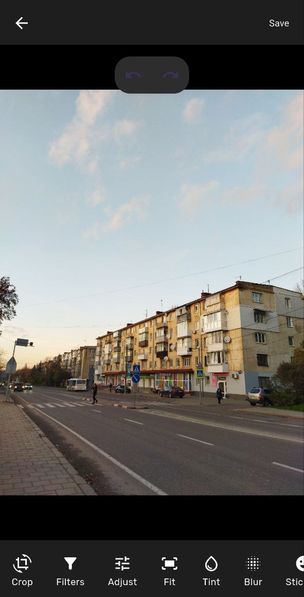

# DartLab (course work)


[🇺🇸 English](README.md) | [🇺🇦 Українська](docs/README.uk.md)


<div style="overflow-x: auto; white-space: nowrap;">
  
  
  
  
  
</div>

---

## App features
### Editing Tools
- **Crop**  Resize and crop images to desired dimensions
- **Filters** - Apply pre-built filters for quick enhancements
- **Adjust** - Fine-tune image parameters:
  - Exposure
  - Contrast
  - Saturation
  - Highlights
  - Shadows
  - Temperature
  - Sharpness
- **Fit** - Adjust image size and aspect ratio
- **Tint** - Modify color tints
- **Blur** - Apply blur effects
- **Stickers** - Add fun stickers to images
- **Text** - Add custom text overlays
- **Draw** - Freehand drawing on images
- **Mask** - Apply masks for creative effects

### Platform Support
- **Mobile** (Android)
- **Desktop** (Windows)

### Additional Features
- **Dark/Light Theme** - Switch between themes
- **Export Quality Settings** - Choose from 30%, 60%, 90%, or 100% quality
- **Preview System** - Fast preview (800px) before full-resolution processing
- **Cross-platform** - Single codebase for all platforms

## Getting Started
### Prerequisites
- Flutter SDK 3.0 or higher
- Dart SDK 3.0 or higher
- Android Studio / Visual Studio

### Installation
1. **Clone the repository**
```bash
git clone https://github.com/marchuk-b/dartlab.git
cd dartlab
```

2. **Install dependencies**
```bash
flutter pub get
```

3. **Run the app**
```bash
# Mobile (Android)
flutter run

# Desktop (Windows)
flutter run -d windows

```

## Build for Production
### Android APK
```bash
# Debug
flutter build apk --debug

# Release
flutter build apk --release

# Split by architecture
flutter build apk --split-per-abi --release
```

### Windows
```bash
flutter build windows --release
```

## Developer
**Bohdan Marchuk**
- Email: marchukbohdan29@gmail.com
- GitHub: [github.com/marchuk-b](https://github.com/marchuk-b)

Made with ❤️ using Flutter