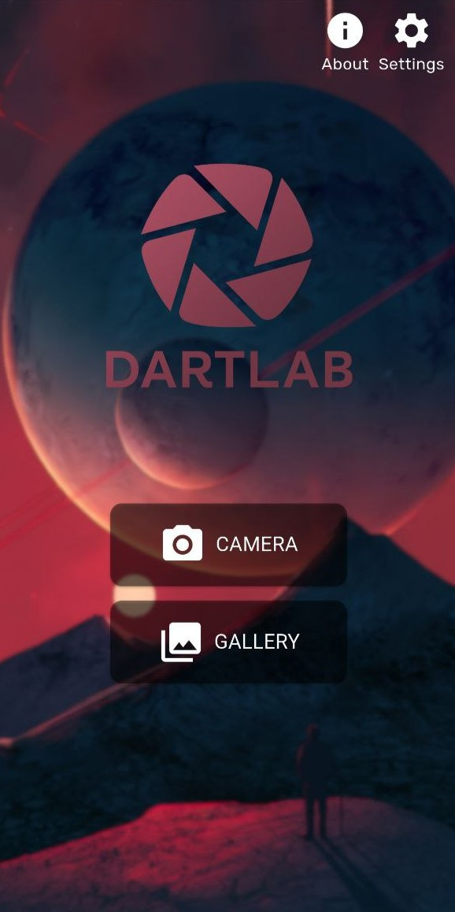
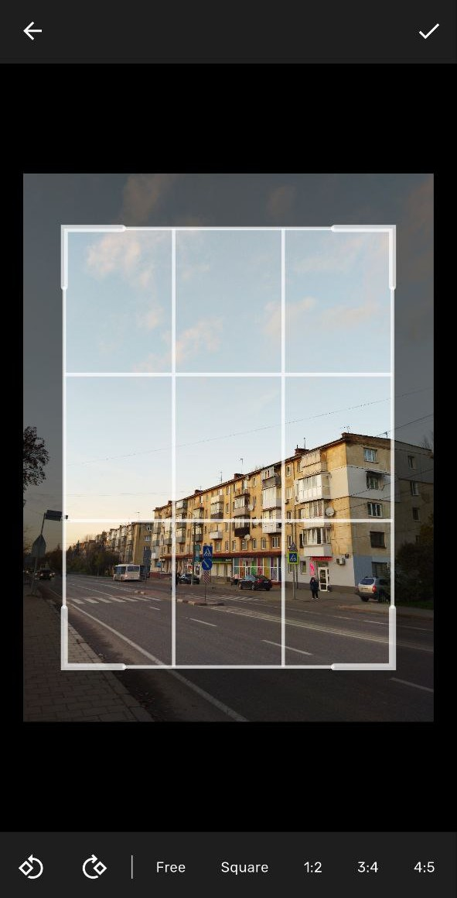
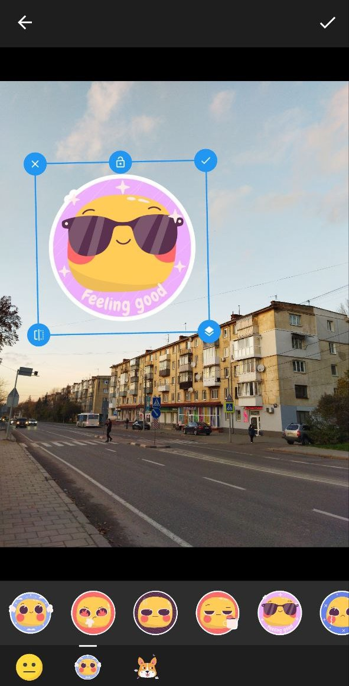

# DartLab (курсова робота)


[🇺🇦 Українська](README.uk.md) | [🇺🇸 English](../README.md)

## Про проєкт
Кросплатформний застосунок для редагування фотографій, створений на Flutter.

## Зміст
- [Про проєкт](#про-проєкт)
- [Можливості](#можливості)
- [Скріншоти](#скріншоти)
- [Початок роботи](#початок-роботи)
- [Збірка для продакшену](#збірка-для-продакшену)
- [Розробник](#розробник)

## Можливості
### Інструменти редагування
- **Обрізка (Crop)** — зміна розміру та кадрування зображень  
- **Фільтри (Filters)** — готові ефекти для швидких покращень  
- **Налаштування (Adjust)** — тонке регулювання параметрів:
  - Експозиція  
  - Контраст  
  - Насиченість  
  - Бліки  
  - Тіні  
  - Температура  
  - Різкість  
- **Fit** — зміна розміру та співвідношення сторін  
- **Tint** — налаштування кольорових відтінків  
- **Blur** — додавання ефекту розмиття  
- **Стікери (Stickers)** — наклейки та графічні елементи  
- **Текст (Text)** — текстові вставки  
- **Малювання (Draw)** — малювання від руки  
- **Маски (Mask)** — застосування креативних масок  

### Додаткові можливості
- **Світла/Темна тема**  
- **Налаштування якості експорту** — 30%, 60%, 90% або 100%  
- **Система попереднього перегляду** — швидкий прев’ю 800px перед фінальною обробкою  
- **Кросплатформеність** — один код для всіх платформ  

## Скріншоти
<div style="overflow-x: scroll; white-space: nowrap;">
  
  
  
  
</div>

## Початок роботи
### Необхідне ПЗ
- Flutter SDK 3.0 або новіший  
- Dart SDK 3.0 або новіший  
- Android Studio / Visual Studio  

### Встановлення
1. **Клонування репозиторію**
```bash
git clone https://github.com/marchuk-b/dartlab.git
cd dartlab
```

2. **Встановлення залежностей**
```bash
flutter pub get
```

3. **Запуск застосунку**
```bash
# Мобільна версія (Android)
flutter run

# Десктоп (Windows)
flutter run -d windows
```

## Збірка для продакшену
### Android APK
```bash
# Debug
flutter build apk --debug

# Release
flutter build apk --release

# Розділена збірка за архітектурами
flutter build apk --split-per-abi --release
```

### Windows
```bash
flutter build windows --release
```

## Розробник
**Богдан Марчук**
- Email: marchukbohdan29@gmail.com
- GitHub: [github.com/marchuk-b](https://github.com/marchuk-b)

---

<div align="center">
  Зроблено з ❤️ на Flutter
  <br/>
  <a href="#dartlab-курсова-робота">⬆ На початок</a>
</div>